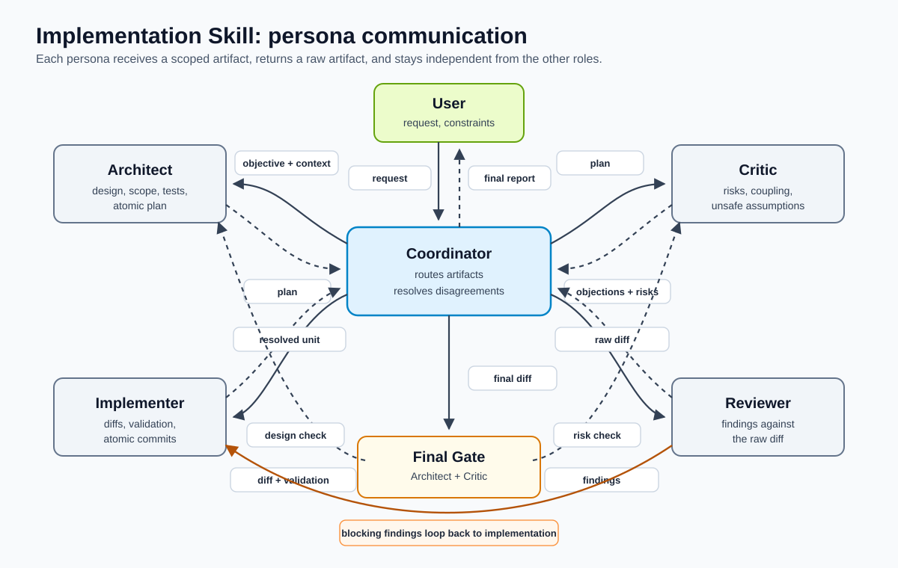

# How It Works

## Implementation Skill

`implementation-skill` is a Wirelog-based harness for code changes, evaluated
through PyreWire. It turns one implementation request into request facts,
evaluates those facts with explicit Wirelog rules, and returns a
machine-readable plan of atomic skills to run.

Use it when the agent should not freely choose its own workflow. The harness
makes the selection explicit: trivial and documentation-only changes can skip
planning and broad tests, but every change still selects independent review,
final Architect and Critic validation, and an atomic commit. Non-trivial,
cross-module, shared-behavior, or external-service changes also select planning,
critique, and broad validation.

## Wirelog Harness

The runtime package exposes:

```bash
agent-workflows-harness "refactor auth workflow and add tests"
```

The command emits JSON:

```json
{
  "request": {
    "request_id": "req",
    "request_type": "code_change",
    "properties": ["needs_tests", "non_trivial", "touches_shared_behavior"]
  },
  "selected": [
    {
      "order": 10,
      "skill_id": "inspect-repository",
      "reason": "code_change_requires_repository_context"
    }
  ],
  "blocked": []
}
```

Selection is computed by Wirelog rules through PyreWire, not by natural-language
skill descriptions.

The harness accepts only its documented request properties and the
`code_change` request type before generating Wirelog source. Unknown or malformed
facts fail with an input error. If a request contains both `trivial` and concrete
risk evidence such as `non_trivial`, shared behavior, external services, or
multi-file scope, the risk evidence wins and the trivial hint is removed.

Documentation-only requests select `implement-atomic-change`, a
documentation-specific focused-validation reason, independent review, final
Architect and Critic validation, and `commit-atomic-change`. They skip planning
and broad tests only when no separate risk fact requires those gates. Multi-file
or explicitly non-trivial documentation may still select the larger workflow, while
`docs_only` combined with external-service or shared-behavior impact is rejected
as contradictory input. Requests with no risk or documentation facts fail
closed to `non_trivial`.

Use `--decision-log path/to/decisions.jsonl` to append the request facts,
selected skills, blocked skills, and rule reasons as durable JSON Lines records.

The compatibility `implementation-skill` entrypoint remains stable for plugin
hosts. A host first checks `PATH`, then an executable harness in the current
workspace's `.venv`, then an active Python environment that can import the
harness module. It tries each available form without installing dependencies or
rewriting the host environment. Only when none can run does the skill fail
closed by using the non-trivial plan manually and reporting that the runtime
selector could not execute. See [Harness command resolution](installation.md#harness-command-resolution)
for the exact platform-specific commands.

The Python runtime depends on `pyrewire>=1.0.4,<2.0`. Runtime-backed tests are
required and fail when PyreWire or its native Wirelog library cannot load; a
load failure is not treated as a skipped optional integration.

## Ontology Fact Source

The text classifier recognizes risk by matching keywords. That fails whenever a
request describes a risky surface without using the expected word:

```
"refactor auth workflow and add tests"
  -> touches_shared_behavior  -> broad tests selected

"small one-line change to the login session expiry"
  -> trivial                  -> planning, critique, and broad tests blocked
```

Both requests change authentication behavior. Only the first says so in words
the regex table happens to contain.

The ontology fact source removes that dependence on phrasing. A request may be
stated as ABox triples over a declared TBox:

```bash
agent-workflows-harness --touches session_module --scope one_line
```

`session_module` is declared as an `AuthSurface`, and `AuthSurface ⊑
SharedBehavior ⊑ Surface`. Wirelog computes the transitive closure, so
`touches_shared_behavior` is derived even though the individual carries no
keyword. The same three gates the keyword path dropped are selected again.

Derived properties are reported with the chain that produced them:

```json
"derived": [
  {
    "property": "touches_shared_behavior",
    "from": "touches(req, session_module)",
    "path": "session_module -> AuthSurface -> SharedBehavior"
  }
]
```

Documentation-only status is inferred rather than asserted: a request is
`docs_only` when every surface it touches is a `DocSurface`. Touching a
`readme` alongside an `auth_module` does not qualify.

The selector remains deterministic and does not call an LLM. An LLM may propose
the triples that reach the CLI, but every property is derived from declared
classes and the closure over them. Ontology-derived properties merge with
`--property` values and text classification, and existing invariants still
apply: concrete risk evidence overrides a `trivial` hint, and `docs_only`
combined with code impact is rejected as contradictory input.

Supply a different TBox with `--ontology path/to/tbox.json`. Teaching the
harness that `billing_ledger` is a persistence surface is one entry in
`surface_class`, not an edit to the classifier. The document is validated on
load: terms must be well formed, classes must be declared, `sub_class_of` must
be acyclic, and mapped properties must be ones the selector supports.

The bundled ontology also classifies every registered skill (`ReviewSkill`,
`TestSkill`, and so on under `ValidationSkill`). The selector rules do not use
that hierarchy yet; it is declared so rule consolidation can be verified
against the current per-skill rules before replacing them.

## Atomic Skills

The implementation harness can select these smaller skills:

- `inspect-repository`
- `classify-change-risk`
- `create-implementation-plan`
- `critique-plan`
- `implement-atomic-change`
- `run-focused-tests`
- `run-broad-tests`
- `review-diff`
- `validate-final-design`
- `validate-final-risks`
- `commit-atomic-change`
- `report-result`

## Persona Communication



The Coordinator is the communication hub. It gathers repository context, runs
the selected atomic skills, sends each persona only the artifact needed for that
role, resolves disagreements, and keeps unrelated work out of scope.

The personas communicate through raw artifacts rather than shared assumptions:

- Architect returns a plan.
- Critic returns objections.
- Implementer returns an uncommitted atomic candidate and validation output.
- Reviewer returns findings against the raw diff.
- Architect and Critic approve the same immutable candidate against the goal.
- Committer verifies and commits only the approved tree.

## Roles

- **Architect** defines the intended behavior, affected files, interfaces, risks, tests, and atomic commit breakdown.
- **Critic** challenges the plan before code changes begin. It looks for hidden coupling, weak assumptions, over-broad scope, and tests that would not prove the behavior.
- **Implementer** produces an uncommitted candidate in reviewable units and validates each unit.
- **Reviewer** reviews the raw diff for bugs, regressions, missing tests, and scope creep.

The coordinating agent sequences those passes, resolves disagreements, and reports the result. It should not replace the role passes with its own unchecked judgment.

## Independence

The workflow depends on separation between roles:

- Architect and Critic should be independent so the critique is not just a confirmation of the plan.
- Implementer and Reviewer should be independent so the reviewer is not checking its own work.
- Final Architect and Critic validation confirms that the finished diff still matches the original goal and that accepted risks are deliberate.

When host-native independent agents are unavailable, the skill switches to degraded sequential mode. The workflow still runs the same gates, but the final report must say which independence guarantees were weakened.

## Atomic Changes and Commits

Implementation is split into commit-sized candidates. Each candidate has one
behavioral purpose, touches only the files needed for that purpose, and remains
uncommitted while tests, independent review, and final Architect and Critic
validation run. Blocking findings loop back through implementation, testing,
and review.

After all three roles approve the same candidate digest, the commit skill stages
only its approved paths and hunks, verifies the staged tree, creates a new commit
without bypassing hooks or amending history, and verifies the commit tree still
matches the approved tree. Multiple candidates repeat this lifecycle and produce
one commit each.

This keeps review focused and makes it easier to identify where a regression entered.

## When to Use It

Use `implementation-skill` for:

- behavior changes with multiple affected files
- risky refactors or migrations
- fixes where the failure mode is not obvious
- changes that need explicit test strategy
- PR feedback that requires implementation and review

For small edits, the Wirelog selector produces the small plan: inspection, risk
classification, atomic candidate implementation, focused tests, independent
review, final Architect and Critic validation, atomic commit, and reporting.

## Close Open Issues Goal

Explicitly invoke `$dev-workflows:close-open-issues-goal` or `/dev-workflows:close-open-issues-goal` (the host-specific form) only when you want to create, set, or start the persistent goal for reducing the current repository's open issue count to zero. Invocation creates the goal only: that same turn must not inspect or prioritize issues, implement work, close issues, or create issues unless those actions are separately requested.

When the goal is later executed, begin with the highest-priority open issue and resolve it using `$dev-workflows:implementation-skill` or `/dev-workflows:implementation-skill`. Work discovered while resolving an issue becomes a follow-up issue only after Architect and Critic have assessed it.

Each follow-up issue records:

- scope and intended outcome;
- discovery context or reproducible steps;
- acceptance criteria;
- priority rationale and dependencies, when known.

The goal has no default token budget; one is supplied only when explicitly requested. If another goal is already active, report that constraint and ask the user how to proceed. Do not replace, complete, or block the existing goal merely to create this one.
